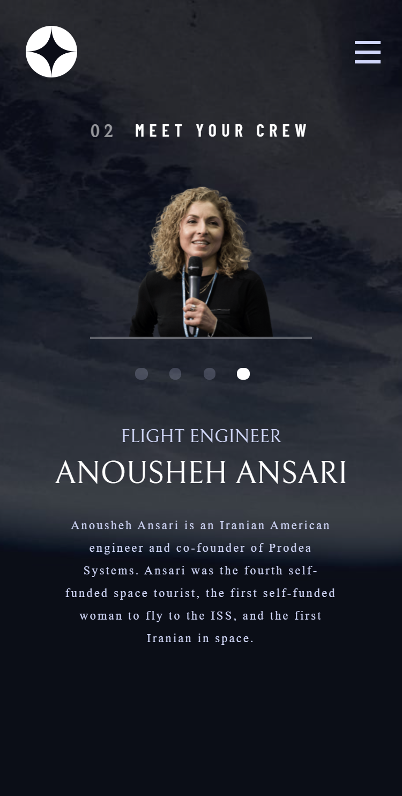

## Table of contents
- [Overview](#overview)
  - [The challenge](#the-challenge)
  - [Screenshot](#screenshot)
  - [Links](#links)
  - [Built with](#built-with)
  - [What I learned](#what-i-learned)
  - [Continued development](#continued-development)
  - [Useful resources](#useful-resources)
- [Author](#author)
- [Acknowledgments](#acknowledgments)

## Overview
### The challenge
Users should be able to:

- View the optimal layout for each of the website's pages depending on their device's screen size
- See hover states for all interactive elements on the page
- View each page and be able to toggle between the tabs to see new information

### Screenshot

### Links

- Live Site URL: [Click me](https://vinnie-tec.github.io/Space-Tourism-Page/crew-engineer.html)

### Built with

- Semantic HTML5 markup
- CSS custom properties
- Flexbox
- CSS Grid
- Little vanilla JS

### What I learned
I learnt some basic styling properties in CSS, flexbox and grid for responsiveness. I learnt how to meddle with the display and position propertiy.

### Continued development

I planned on working more on responsive designs, exploring deep into JS and React.

### Useful resources

- [Example resource 1](https://github.com/LoufaSupreme/scrimba_space-tourism/blob/main/index.css) - This helped me in some area I'm confused. I really liked the way he structured his CSS properties.

## Author

- Frontend Mentor - [@Vinnie-tec](https://www.frontendmentor.io/profile/Vinnie-tec)
- Twitter - [@VinnieOlamide](https://www.twitter.com/VinnieOlamide)
- Linkedin - [@agboola-vincent](https://www.linkedin.com/in/agboola-vincent)

## Acknowledgments

All thanks to Scrimba's course of this project. I got help in some of the video. 
#